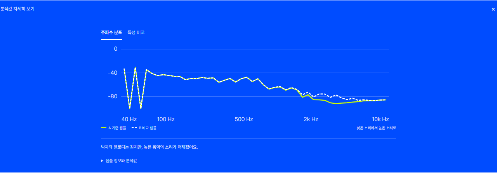

# SoundMatch

**음악 파일을 올리면 비슷한 곡을 찾아줍니다.**

MP3나 WAV 파일을 올려 등록된 **781곡** 중 소리가 비슷한 곡을 찾아보세요.
두 곡의 차이는 그래프로 볼 수 있고, 준비된 샘플은 번갈아 들으며 비교할 수 있습니다.

[시작하기](#시작하기) · [사용 방법](#비슷한-곡-찾기) · [문제 신고·기능 제안](https://github.com/easygap/music_similarity/issues/new/choose)

[](https://github.com/easygap/music_similarity/actions/workflows/ci.yml) [](LICENSE)


## 비슷한 곡 찾기

1. **음악 파일을 올리세요.** 파일을 끌어 놓으세요. 클릭해서 골라도 됩니다.
2. **‘닮은 곡 찾기’를 누르세요.** 비슷한 곡과 함께, 박자·음색 등 어떤 부분이 닮았는지 보여줍니다.
3. **마음에 드는 곡에서 더 찾아보세요.** ‘이 곡에서 계속 찾기’를 누르면 그 곡을 기준으로 다시 추천합니다.


MP3·WAV·FLAC·OGG·M4A를 지원합니다. 파일은 **25MB까지**, 분석은 **앞부분 30초까지** 가능합니다.
추천 곡은 YouTube·Spotify 검색 링크로 찾아 들을 수 있습니다.

## 샘플로 먼저 써 보기

음악 파일이 없어도 괜찮습니다. 첫 화면에 있는 9초짜리 샘플을 재생해 보세요.
직접 만든 곡의 음색과 리듬을 바꿔 놓았습니다.

**A와 B를 번갈아 누르면 같은 부분을 이어서 들을 수 있습니다.**
‘겹쳐 보기’로 두 그래프를 포개 보거나, ‘분석값 자세히 보기’에서 숫자를 확인해 보세요.

| 샘플 | 바꾼 부분 | 유사도 |
| --- | --- | ---: |
| 밝은 음색 | 멜로디와 박자는 그대로 두고 음색만 변경 | 91.2% |
| 빠른 리듬 | 템포를 높이고 드럼 패턴도 변경 | 80.9% |

위 점수는 각 샘플을 원본과 비교한 결과입니다. 화면의 그래프도 실제 샘플에서 뽑은 값으로 그렸습니다.

샘플 파일 받기: [원본 WAV](frontend/assets/demo/original.wav?raw=true) · [밝은 음색 WAV](frontend/assets/demo/tone.wav?raw=true) · [빠른 리듬 WAV](frontend/assets/demo/rhythm.wav?raw=true)

<details>
<summary>샘플 분석 화면 보기</summary>



</details>

## 두 곡 나란히 비교하기

분석 기록에서 두 곡을 고르면 박자, 음량, 음색을 한 화면에서 비교할 수 있습니다.
분석한 곡이 아직 없다면 ‘샘플로 비교해 보기’를 눌러 보세요.


마음에 드는 곡은 **즐겨찾기**에 저장해 두세요.
추천 결과는 **링크로 공유**하거나 **이미지·표 파일로 저장**할 수 있습니다. PNG·SVG·CSV·JSON을 지원합니다.

<details>
<summary>곡 목록·모바일·다크 모드 화면 보기</summary>

등록된 곡은 ‘카탈로그’에서 검색할 수 있습니다. 박자와 음량으로 범위를 좁힐 수도 있습니다.


모바일 화면과 다크 모드를 지원합니다. 한국어·영어로 바꿔 쓸 수 있고, 키보드로도 조작할 수 있습니다.

<table>
<tr>
<td width="70%" valign="top"></td>
<td width="30%" valign="top"></td>
</tr>
</table>

</details>

## 시작하기

**내 컴퓨터에서 실행하기** — Docker가 있다면 아래 명령을 입력하세요.

```bash
git clone https://github.com/easygap/music_similarity.git
cd music_similarity
docker compose up --build
```

실행이 끝나면 브라우저에서 **[localhost:8000](http://localhost:8000)**을 여세요.
첫 화면에서 샘플을 들어보거나, ‘방금 들은 샘플로 분석해 보기’를 눌러 실제 추천 결과를 확인할 수 있습니다.
처음 실행할 때는 필요한 프로그램을 내려받아 시간이 걸립니다.

<details>
<summary>Docker 없이 Python으로 실행하기</summary>

Python 3.11·3.12·3.14에서 확인했습니다. [FFmpeg](https://ffmpeg.org/download.html)를 먼저 설치해 주세요.
위의 `git clone`과 `cd` 명령을 실행한 뒤, 사용하는 운영체제에 맞는 명령을 입력하세요.

**Windows PowerShell**

```powershell
python -m venv .venv
.venv\Scripts\python.exe -m pip install -r requirements.txt
.venv\Scripts\python.exe -m uvicorn backend.main:app
```

**macOS·Linux**

```bash
python3 -m venv .venv
.venv/bin/python -m pip install -r requirements.txt
.venv/bin/python -m uvicorn backend.main:app
```

실행 후 접속 주소는 동일하게 [localhost:8000](http://localhost:8000)입니다.

</details>

## 사용 전에 알아두세요

**어떤 곡을 찾아주나요?**

프로젝트에 등록된 781곡 안에서 찾습니다. 제목이나 가사가 아니라 실제 소리를 분석해 비교합니다.

**올린 파일은 어디에 저장되나요?**

파일은 SoundMatch를 실행한 서버에서 분석하고, 분석이 끝나면 삭제합니다.
위 방법으로 내 컴퓨터에서 실행하면 파일도 내 컴퓨터에서 처리합니다. AI 학습에 사용하지 않습니다.
분석 기록과 즐겨찾기는 사용 중인 브라우저에 저장됩니다.

**유사도가 높으면 표절인가요?**

아닙니다. 박자나 음색 같은 소리의 특징을 비교한 점수입니다.
곡의 앞부분만 분석하기 때문에, 후렴처럼 뒤에 나오는 부분은 결과에 반영되지 않을 수 있습니다.

**가입이나 API 키가 필요한가요?**

필요 없습니다. 저장소에 포함된 데이터로 실행할 수 있습니다.

## 의견 남기기

쓰다가 불편한 점이나 추가했으면 하는 기능이 있다면 [이슈](https://github.com/easygap/music_similarity/issues/new/choose)에 남겨 주세요.
오류를 알려주실 때는 사용한 브라우저와 어떤 버튼을 눌렀는지 적어 주시면 도움이 됩니다.
다시 찾아보고 싶다면 오른쪽 위의 **Star**로 저장해 두세요.

[개발에 참여하기](CONTRIBUTING.md) · [변경 이력](CHANGELOG.md) · [화면·속도 확인 결과](docs/verification-2026.md)

---

졸업작품 [capstone_music](https://github.com/easygap/capstone_music)에서 시작한 음악 추천 프로젝트입니다.
FastAPI·librosa·scikit-learn·HTML·CSS·JavaScript로 만들었습니다.
코드와 직접 만든 샘플 음원은 [MIT 라이선스](LICENSE), 글꼴은 SIL OFL을 따릅니다.
[Pretendard](frontend/assets/fonts/OFL.txt) · [LINE Seed KR](frontend/assets/fonts/LINE-Seed-OFL.txt)
