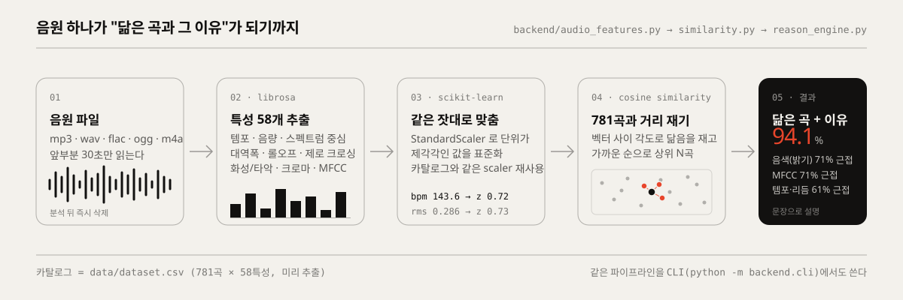
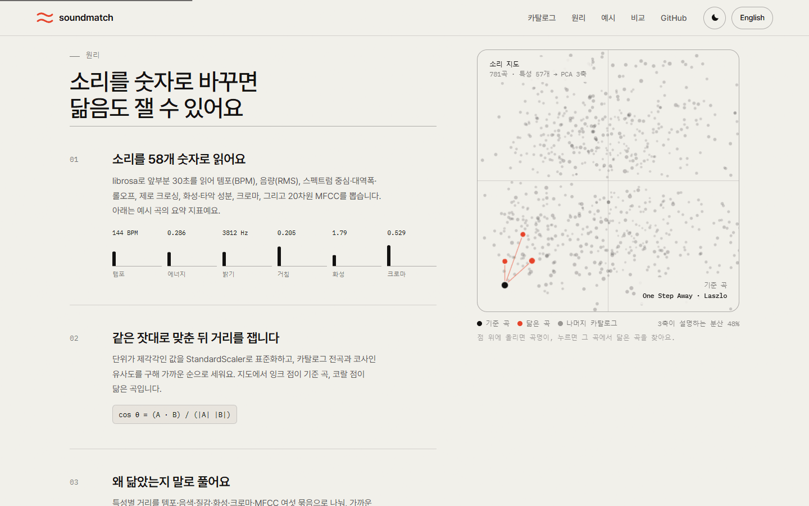
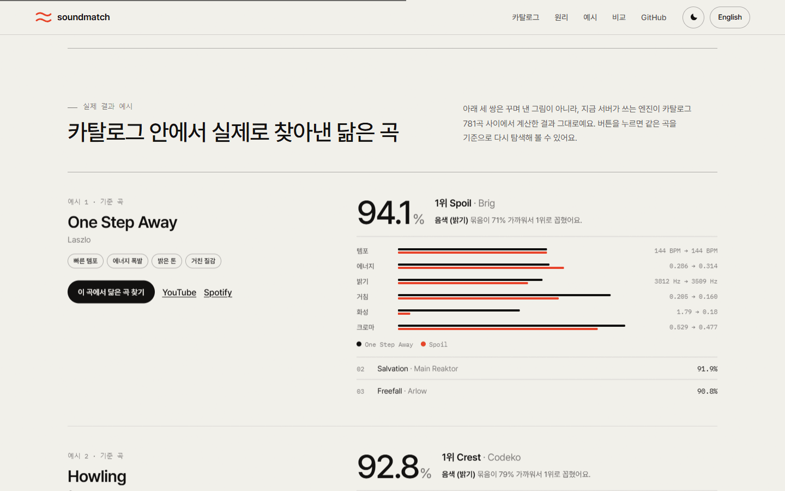
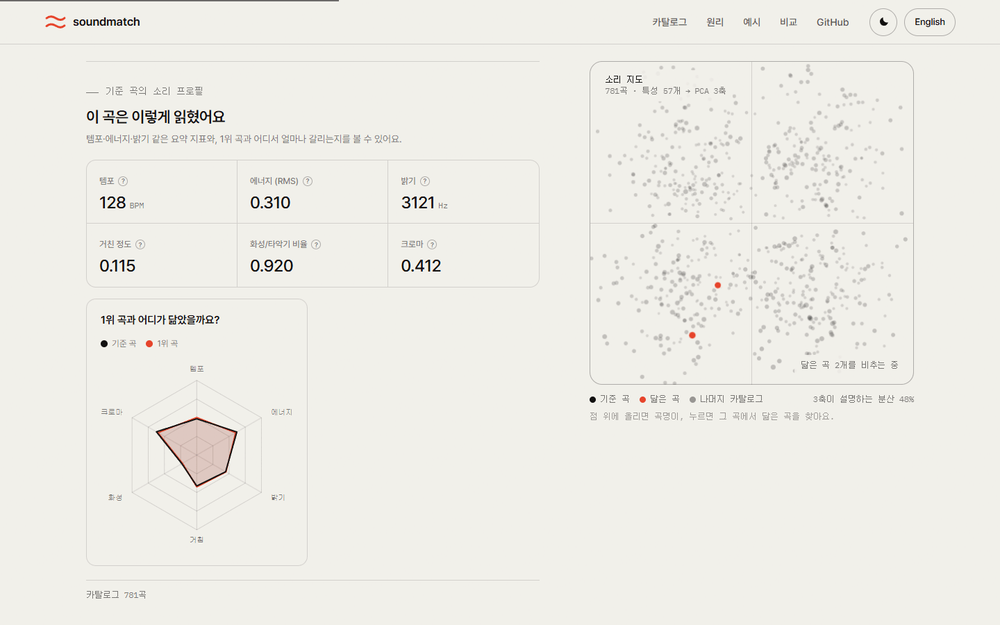

<div align="center">


# SoundMatch

**음악 파일 하나를 올리면, 소리가 닮은 곡을 찾아서 왜 닮았는지까지 알려주는 웹 서비스**


[어떻게 찾아내나](#어떻게-찾아내나) · [실제 결과 예시](#실제로-이렇게-찾아냅니다) · [바로 실행하기](#바로-실행하기) · [BI 가이드](docs/brand/README.md)

</div>


<br>

## 한 줄로 말하면

좋아하는 곡의 파일을 올리면 → librosa 로 소리 특성 58개를 뽑고 → 미리 계산해 둔 카탈로그 781곡과
코사인 유사도로 견줘서 → 가장 닮은 곡 N개와 **어디가 닮았는지**를 문장으로 돌려준다.
제목이나 장르 태그는 전혀 쓰지 않는다. 오로지 소리만 본다.

- **입력** — mp3 · wav · flac · ogg · m4a, 25MB 이하. 앞부분 30초만 읽고, 분석이 끝나면 즉시 지운다.
- **출력** — 상위 N곡과 유사도(%), 닮은 이유(템포·음색·질감·화성·크로마·MFCC 묶음별 근접도),
  요약 지표 6개, 멜 스펙트로그램. 결과 곡을 새 기준으로 삼아 계속 탐색할 수 있다.
- **뿌리** — 졸업작품 [easygap/capstone_music](https://github.com/easygap/capstone_music) 의 분석 노트북.
  알고리즘은 그대로 두고 FastAPI 서버, 화면, CLI, PWA, Docker, CI 를 새로 얹었다.

<br>

## 어떻게 찾아내나



1. **소리를 숫자로 읽는다.** librosa 로 앞부분 30초를 읽어 템포(BPM), 음량(RMS), 스펙트럼 중심·대역폭·롤오프,
   제로 크로싱, 화성·타악 성분, 크로마, 20차원 MFCC 를 뽑는다. 카탈로그 CSV 와 컬럼이 1:1 로 같다.
2. **같은 잣대로 맞춘 뒤 거리를 잰다.** 단위가 제각각인 값을 `StandardScaler` 로 표준화하고
   카탈로그 전곡과 `cosine_similarity` 를 구해 가까운 순으로 세운다. 스케일러는 카탈로그를 읽을 때 한 번만 fit 한다.
3. **왜 닮았는지 말로 푼다.** 특성별 거리를 여섯 묶음으로 나눠 가까운 묶음부터 한국어 문장으로 설명한다.
   "템포 & 리듬 측면에서 거의 같은 특성을 보입니다" 같은 식이다.

메인 화면의 **원리** 섹션은 이 세 단계를 예시 곡의 실제 값으로 보여준다. 스크롤을 내리면 오른쪽 소리 지도가 단계에 맞춰 바뀐다.



<br>

## 실제로 이렇게 찾아냅니다

메인 화면에는 서버 엔진이 카탈로그 안에서 실제로 계산한 예시 세 쌍을 그대로 실었다.
꾸며 낸 숫자가 아니라 `scripts/build_landing_data.py` 를 돌릴 때마다 엔진에서 나오는 결과다.
제목만 다른 동일 음원(유사도 100%) 쌍은 예시에서 뺐다.

| 기준 곡 | 1위 곡 | 유사도 | 가장 닮은 묶음 |
| --- | --- | ---: | --- |
| One Step Away · Laszlo | Spoil · Brig | 94.1% | 음색 (밝기) 71% |
| Howling · Cartoon | Crest · Codeko | 92.8% | 음색 (밝기) 79% |
| Feel The Buzz · Sub.Sound | Don't Look Down · Laszlo | 90.5% | 음정 분포 (크로마) 89% |



<br>

## 소리 지도

카탈로그 781곡을 서버와 같은 `StandardScaler` 공간에서 PCA 3축으로 눌러 캔버스에 찍었다.
가까이 있는 점일수록 소리가 닮은 곡이다. 스크롤에 따라 천천히 돌고, 점 위에 올리면 곡명이,
누르면 그 곡을 기준으로 바로 탐색한다. 분석 결과가 뜨면 기준 곡(잉크)과 닮은 곡(코랄)이 지도 위에 표시된다.

외부 라이브러리 없이 canvas 2D 하나로 그린다. 화면에 보일 때만, 바뀐 게 있을 때만 다시 그리고
유휴 회전은 30fps 로 제한한다. 좌표는 빌드 시점에 계산해 50KB 남짓한 정적 파일로 싣는다.

<br>

## 결과 화면


순위마다 유사도 막대, 닮은 이유 문장, 핵심 지표 비교(기준 곡=잉크, 매칭 곡=코랄), YouTube·Spotify 검색 링크가 붙는다.
**이 곡에서 계속 찾기** 를 누르면 결과 곡이 새 기준이 되어 탐색이 이어지고, 이전 결과로 한 단계 돌아갈 수 있다.
결과는 JSON·CSV·SVG·PNG 로 내보내거나, 결과 데이터가 담긴 링크 하나로 공유할 수 있다.



<br>

## 둘러보고, 비교하고

<table>
<tr>
<td width="50%" valign="top">

**카탈로그** — 검색하고 BPM·에너지로 걸러 곡을 훑어보다가, 마음에 드는 곡을 누르면 그 곡과 닮은 곡을 바로 띄운다.
즐겨찾기, CSV 내보내기, 곡 단위 공유 링크까지.


</td>
<td width="50%" valign="top">

**비교** — 최근 분석한 두 곡을 나란히 놓고 요약 지표와 1위 곡을 맞대본다. 좋아진 값은 초록, 나빠진 값은 빨강.


</td>
</tr>
</table>

<table>
<tr>
<td width="64%" valign="top">

**다크 모드** — 종이와 잉크를 뒤집은 별도 세트. 코랄은 어두운 종이 위에서 원래 색으로 돌아간다.


</td>
<td width="36%" valign="top">

**모바일** — 한 열로 다시 배열되고, 지도는 첫 문단 아래로 내려온다. 홈 화면에 추가하면 오프라인에서도 지난 결과를 연다.


</td>
</tr>
</table>

<br>

## 화면을 이렇게 만든 이유

- **종이 위의 잉크.** 배경은 종이색 한 장, 글자는 잉크 한 색, 강조는 코랄 한 색. 카드 그림자, 유리 효과, 그라데이션은 쓰지 않고
  1px 괘선으로만 영역을 나눈다. 회귀 테스트가 이 규칙을 지킨다.
- **그림은 전부 실제 데이터.** 소리 지도, 지표 막대, 레이더, 스펙트로그램 모두 엔진이 계산한 값이다. 스톡 이미지나 장식 그래픽은 없다.
- **글꼴은 두 종류.** 본문은 Pretendard Variable(동적 서브셋), 숫자와 라벨은 IBM Plex Mono.
- **프레임워크도 빌드도 없다.** HTML·CSS·JS 그대로 서빙한다. 스크롤 연동 효과는 CSS `animation-timeline` 을 쓰고,
  지원하지 않는 브라우저에서는 조용히 정적으로 보인다.

<br>

## 바로 실행하기

```bash
python -m venv .venv
source .venv/bin/activate          # Windows: .venv\Scripts\activate
pip install -r requirements-dev.txt

uvicorn backend.main:app --reload   # → http://localhost:8000
```

Docker 가 편하면 `docker compose up --build` 한 줄이면 된다.
무거운 오디오 라이브러리 없이 **화면만** 보고 싶다면 `python preview_server.py 8790` — 더미 데이터로 전 페이지가 그대로 뜬다.

<br>

## 조금 더 들어가면

- **CLI** — 서버 없이 파일·폴더 단위 분석, 두 곡 비교, 배포 헬스체크까지 (`python -m backend.cli --help`)
- **API** — 모든 엔드포인트는 `/docs` 의 Swagger 문서에서 바로 눌러볼 수 있다
- **설정** — rate limit · CORS · 캐시 · 프록시 신뢰 범위 등은 `MUSIC_*` 환경 변수로 조정
- **카탈로그 교체** — `scripts/rebuild_dataset.py` 로 내 음원 폴더를 통째로 다시 카탈로그화한 뒤,
  `python scripts/build_landing_data.py` 로 소리 지도와 예시를 다시 만든다

**기술 스택** &nbsp;·&nbsp; Python · FastAPI · librosa · scikit-learn · numpy 위에, 프레임워크 없이 짠 Vanilla JS + CSS PWA.
배포는 Docker, 검증은 GitHub Actions(3개 파이썬 버전 매트릭스).

<br>

## 운영 메모

배포된 서버가 기대한 버전인지 확인할 때는 CLI 를 바로 쓴다.

```bash
python -m backend.cli version
# v1.9.0 · 2026-09-18 · <git-sha>

python -m backend.cli status --url https://your-soundmatch.example --ready
```

핵심 설정만 추리면 아래 정도다. 전체 값은 `backend/main.py` 의 `MUSIC_*` 기본값을 따른다.

| 이름 | 기본 | 설명 |
| --- | --- | --- |
| `MUSIC_ENV` | `development` | `production` 이면 HSTS 와 엄격한 CORS 설정을 사용한다. |
| `MUSIC_DATASET_PATH` | `data/dataset.csv` | 비교에 사용할 카탈로그 CSV 경로. |
| `MUSIC_MAX_UPLOAD_BYTES` | `26214400` | 업로드 파일 크기 제한. 기본은 25MB. |
| `MUSIC_RATE_LIMIT_PER_MIN` | `12` | IP 기준 분당 분석 요청 한도. |
| `MUSIC_GIT_COMMIT` | "" | `/api/version` 과 `/api/health` 에 노출할 짧은 배포 SHA. |
| `WEB_CONCURRENCY` | `1` | Docker / Render / Fly 기본값은 단일 worker. rate limit, 캐시, metrics 가 메모리 기반이라 여러 worker 를 쓰려면 Redis 같은 외부 상태 저장소를 먼저 붙여야 한다. |

<br>

## 릴리즈

1. `CHANGELOG.md` 의 `[Unreleased]` 내용을 `## [x.y.z] — YYYY-MM-DD` 섹션으로 옮긴다.
2. `backend/__init__.py` 의 `__version__` 을 같은 `x.y.z` 로 올린다.
3. README 의 `python -m backend.cli version` 출력 예시와 OpenAPI 스키마 예시도 같은 버전으로 맞춘다.
4. main CI 가 초록인지 확인한 뒤 `git tag vx.y.z && git push origin vx.y.z`.

태그가 푸시되면 GitHub Release 워크플로가 CHANGELOG 섹션을 그대로 릴리즈 노트로 사용한다.
태그 버전, `backend.__version__`, `CHANGELOG.md` 의 릴리즈 섹션이 하나라도 다르면 릴리즈 생성을 중단한다.

<br>

## 알아둘 것

- 분석은 곡의 **앞 30초**만 본다. 가장 특징적인 후렴구가 안 잡힐 수 있다.
- 카탈로그는 **781곡** 규모라 장르가 한쪽으로 쏠려 있다. 낯선 장르를 올리면 1위도 50%대로 떨어질 수 있고,
  그럴 땐 결과 화면이 솔직하게 알려준다. 더 커지면 코사인 유사도 대신 Annoy·FAISS 같은 ANN 구조가 맞다.
- rate limit·metrics 가 메모리 기반이라, 여러 워커로 띄우면 값이 워커별로 나뉜다.
- 결과는 **취향·학습용**이다. 저작권이나 표절 판단의 근거는 될 수 없다.

<br>

## 라이선스

MIT. 원작 캡스톤 데이터셋과 코드는 [easygap/capstone_music](https://github.com/easygap/capstone_music) 에서 볼 수 있다.
