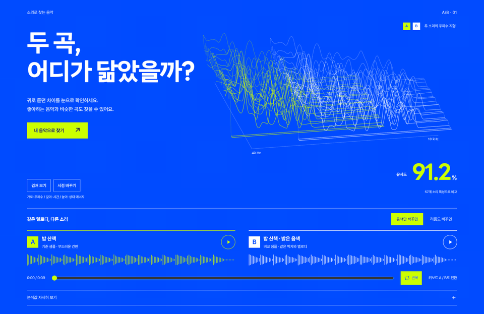
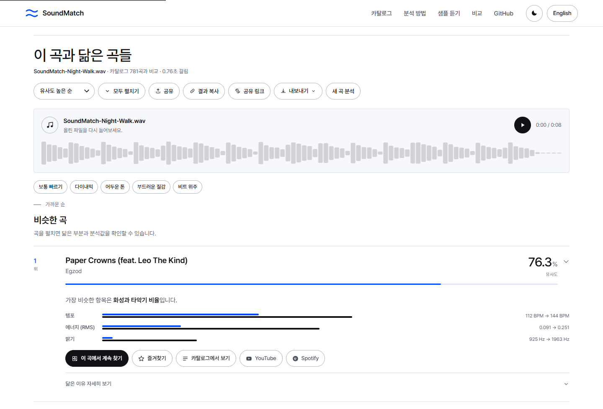
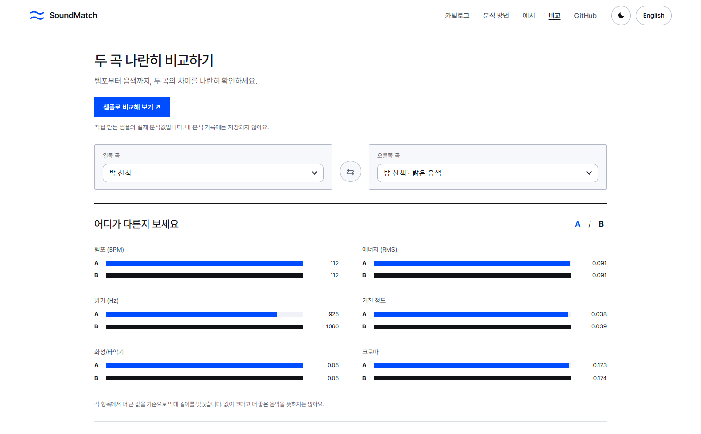
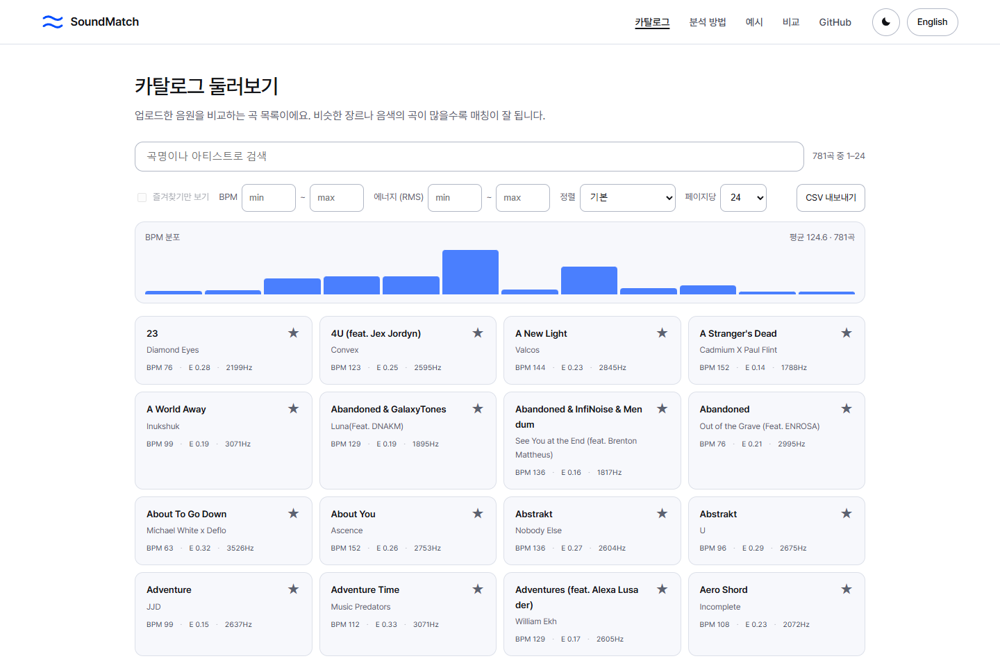
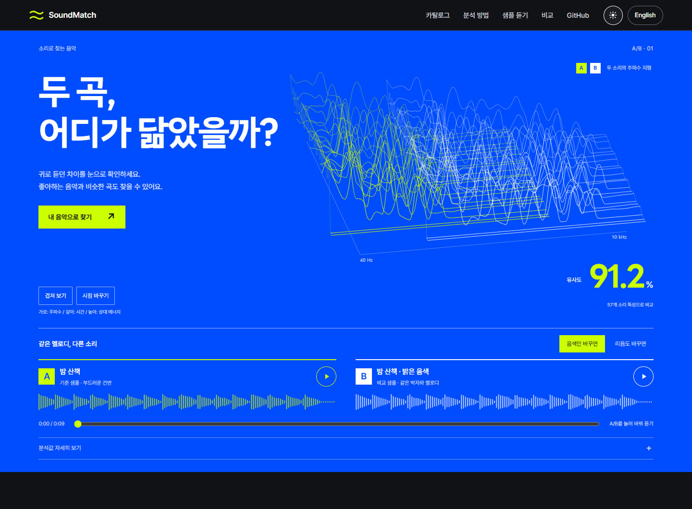
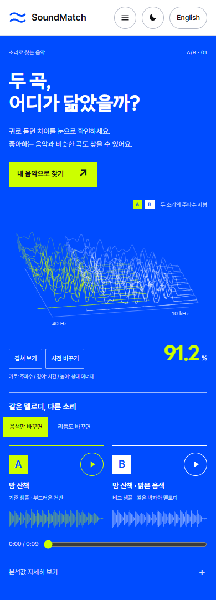

# SoundMatch

**한국어** · [English](docs/readme/README.en.md) · [日本語](docs/readme/README.ja.md) · [简体中文](docs/readme/README.zh-CN.md)

**음악 파일로 비슷한 곡을 찾는 웹 앱입니다.**

MP3나 WAV 파일을 올리면 등록된 **781곡** 중에서 비슷한 곡을 추천합니다.
템포와 음색 등 어떤 부분이 비슷한지도 그래프로 볼 수 있습니다.
내 컴퓨터에서 실행하며, 회원가입이나 API 키는 필요 없습니다.

[실행 방법](#start) · [사용 방법](#find-tracks) · [오류 제보](https://github.com/easygap/music_similarity/issues/new/choose)

<picture>
  <source media="(prefers-reduced-motion: reduce)" srcset="docs/screenshots/hero.png">
  
</picture>

## 샘플부터 들어보기

첫 화면에는 같은 곡의 음색과 리듬을 바꾼 **9초짜리 샘플**이 있습니다.
**A와 B의 재생 버튼을 번갈아 누르면 같은 부분을 이어서 들을 수 있습니다.**
샘플 영역에서는 키보드 A·B 키도 쓸 수 있고, ‘반복’을 켜면 끝난 뒤 처음부터 다시 재생합니다.

듣고 있는 곡은 그래프에 굵은 실선으로, 다른 곡의 같은 부분은 점선으로 표시됩니다.
‘겹쳐 보기’를 누르면 두 그래프를 포개서 볼 수 있습니다.

위 GIF에는 소리가 없습니다. 직접 들으려면 앱을 실행하거나 샘플 파일을 받으세요.
[원본](frontend/assets/demo/original.wav?raw=true) · [밝은 음색](frontend/assets/demo/tone.wav?raw=true) · [빠른 리듬](frontend/assets/demo/rhythm.wav?raw=true)

<a name="find-tracks"></a>

## 내 음악으로 비슷한 곡 찾기

1. 음악 파일을 끌어 놓거나 클릭해서 고릅니다.
2. **‘닮은 곡 찾기’**를 누르면 비슷한 곡부터 보여줍니다.
3. 추천 곡이 마음에 들면 **‘이 곡에서 계속 찾기’**로 다른 곡도 찾아보세요.



추천 곡은 YouTube나 Spotify 검색 링크로 찾아 들을 수 있습니다.

| 올릴 수 있는 파일 | 한 번에 올릴 수 있는 크기 | 분석하는 부분 |
| --- | --- | --- |
| MP3 · WAV · FLAC · OGG · M4A | 최대 25MB | 곡의 처음 30초까지 |

## 두 곡 비교하기

분석 기록에서 두 곡을 고르면 템포, 음량, 음색을 나란히 볼 수 있습니다.
아직 분석한 곡이 없다면 **‘샘플로 비교해 보기’**로 확인해 보세요.



마음에 드는 곡은 **즐겨찾기**에 저장할 수 있습니다.
분석 결과는 **링크로 공유**하거나 **이미지(PNG·SVG), 표(CSV), 데이터(JSON)**로 저장할 수 있습니다.

## 등록된 곡 둘러보기

‘카탈로그’에서 곡명이나 가수 이름으로 검색할 수 있습니다. 템포와 음량을 골라 곡 목록을 좁힐 수도 있습니다.



<details>
<summary>모바일 화면과 다크 모드</summary>

<table>
<tr>
<td width="70%" valign="top"></td>
<td width="30%" valign="top"></td>
</tr>
</table>

앱 화면은 한국어·영어를 지원합니다. 이 README는 상단 링크에서 영어·일본어·중국어로도 읽을 수 있습니다.

</details>

<a name="start"></a>

## 내 컴퓨터에서 실행하기

[Git](https://git-scm.com/downloads)과 [Docker](https://docs.docker.com/get-started/get-docker/)가 설치되어 있다면 아래 명령을 실행하세요.

```bash
git clone https://github.com/easygap/music_similarity.git
cd music_similarity
docker compose up --build
```

서버가 실행되면 브라우저에서 **[localhost:8000](http://localhost:8000)**을 엽니다.
처음에는 필요한 파일을 내려받느라 시간이 좀 걸립니다.

음악 파일을 따로 고르지 않아도, 첫 화면의 **‘방금 들은 샘플로 분석해 보기’**를 누르면 추천 결과까지 볼 수 있습니다.

<details>
<summary>Docker 없이 실행하려면</summary>

Python 3.11·3.12·3.14에서 실행을 확인했습니다. [FFmpeg](https://ffmpeg.org/download.html)도 설치해 주세요.
위의 `git clone`과 `cd`까지 실행한 뒤, 사용하는 운영체제에 맞춰 아래 명령을 입력합니다.

**Windows PowerShell**

```powershell
python -m venv .venv
.venv\Scripts\python.exe -m pip install -r requirements.txt
.venv\Scripts\python.exe -m uvicorn backend.main:app
```

**macOS · Linux**

```bash
python3 -m venv .venv
.venv/bin/python -m pip install -r requirements.txt
.venv/bin/python -m uvicorn backend.main:app
```

접속 주소는 [localhost:8000](http://localhost:8000)입니다.

</details>

## 자주 묻는 질문

**어떤 곡을 추천하나요?**

앱에 포함된 781곡 안에서 찾습니다. 인터넷의 모든 곡을 검색하는 서비스는 아닙니다.
어떤 곡이 있는지는 앱의 ‘카탈로그’에서 볼 수 있습니다.

**올린 파일은 저장되나요?**

실행 중인 서버에서 잠시 분석한 뒤 삭제합니다. 위 방법으로 내 컴퓨터에서 실행하면 내 컴퓨터에서만 처리됩니다.
AI 학습에는 사용하지 않습니다. 분석 기록과 즐겨찾기는 브라우저에 저장됩니다.

**유사도 점수는 무슨 뜻인가요?**

템포와 음색 같은 소리의 특징이 얼마나 비슷한지 나타낸 값입니다. 멜로디가 얼마나 같은지, 표절인지를 판단하는 점수는 아닙니다.
처음 30초까지만 분석하므로 뒤에 나오는 후렴 등은 반영되지 않습니다.

**문제가 생기면 어디에 알려야 하나요?**

[이슈](https://github.com/easygap/music_similarity/issues/new/choose)에 사용한 브라우저와 문제가 생긴 과정을 적어 주세요. 화면 캡처가 있으면 원인을 찾는 데 도움이 됩니다.

---

졸업작품 [capstone_music](https://github.com/easygap/capstone_music)에서 시작했습니다.
[개발 참여 안내](CONTRIBUTING.md) · [변경 이력](CHANGELOG.md) · [테스트·성능 확인 결과](docs/verification-2026.md)

코드와 직접 만든 샘플 음원은 [MIT 라이선스](LICENSE)로 배포합니다. 글꼴은 SIL OFL을 따릅니다.
[Pretendard](frontend/assets/fonts/OFL.txt) · [LINE Seed KR](frontend/assets/fonts/LINE-Seed-OFL.txt)
