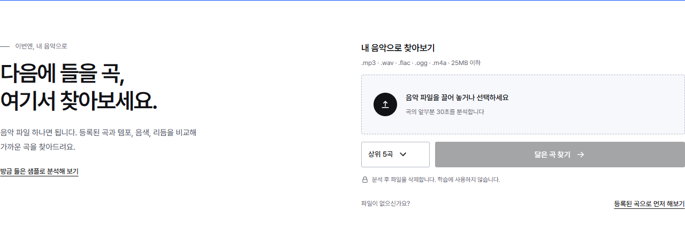

<div align="center">


# SoundMatch

**두 곡, 어디가 닮았을까?**

음악을 듣고, 소리의 차이를 보고, 좋아하는 곡과 비슷한 음악을 찾는 웹 서비스입니다.

[](https://github.com/easygap/music_similarity/actions/workflows/ci.yml)


[샘플 듣기와 비교](#먼저-들어보세요) · [내 음악으로 찾기](#좋아하는-곡에서-다음-곡으로) · [실행 방법](#직접-실행하기)

</div>


## 먼저 들어보세요

파일을 준비하지 않아도 됩니다. 첫 화면에서 9초짜리 샘플 **〈밤 산책〉**을 재생해 보세요.
같은 멜로디의 음색을 바꾸거나 리듬까지 바꿔 가며, 소리가 얼마나 달라지는지 직접 비교할 수 있습니다.
A와 B를 바꿔 눌러도 재생 위치는 이어집니다.

화면의 선은 샘플에서 뽑은 실제 주파수 데이터입니다. 두 곡을 겹치고 시점을 바꾸면 시간에 따른 차이가 드러납니다.
‘분석값 자세히 보기’를 열면 주파수 분포, 특성별 막대그래프, 숫자를 함께 볼 수 있습니다.

| 비교 | 바뀐 점 | 분석 유사도 |
| --- | --- | ---: |
| 원본 ↔ 밝은 음색 | 멜로디와 박자는 유지하고 음색 변경 | **91.2%** |
| 원본 ↔ 빠른 리듬 | 템포와 드럼 패턴까지 변경 | **80.9%** |

샘플은 이 프로젝트에서 직접 합성한 음원입니다. 표시된 값은 실제 분석 엔진으로 계산했으며, 유사도는 두 곡이 같을 확률이나 표절 확률을 뜻하지 않습니다.

[원본 WAV](frontend/assets/demo/original.wav) · [밝은 음색 WAV](frontend/assets/demo/tone.wav) · [빠른 리듬 WAV](frontend/assets/demo/rhythm.wav)

<details>
<summary>주파수 분석 화면 보기</summary>


</details>

## 좋아하는 곡에서 다음 곡으로

음악 파일을 올리면 등록된 **781곡**에서 소리가 비슷한 곡을 찾습니다.
곡의 앞부분 최대 30초를 읽고, 템포·음량·음색 등을 나타내는 **57개 특성**을 비교합니다.
제목이나 장르 태그로 검색하는 방식은 아닙니다.



MP3·WAV·FLAC·OGG·M4A를 지원하며 파일 크기는 25MB까지입니다.
분석이 끝나면 업로드한 파일은 서버에서 삭제합니다. 별도 가입 없이 사용할 수 있습니다.


결과에는 **얼마나 닮았는지, 어떤 특성이 가까운지**가 함께 나옵니다.
마음에 드는 곡에서 ‘이 곡에서 계속 찾기’를 누르면 그 곡을 기준으로 탐색을 이어 갑니다.
즐겨찾기에 저장하거나 YouTube·Spotify 검색으로 넘어갈 수도 있습니다.

결과는 링크로 공유하고 JSON·CSV·SVG·PNG로 저장할 수 있습니다.
공유 링크에는 추천 결과와 요약 지표를 담고, 용량이 큰 스펙트로그램은 제외합니다.
분석 기록과 즐겨찾기는 현재 브라우저에 보관됩니다.

## 숫자로 나란히 비교하기


최근 분석한 두 곡을 골라 여섯 가지 요약 지표를 비교합니다.
처음 방문했다면 ‘샘플로 비교해 보기’로 시작할 수 있습니다.
막대는 각 항목의 상대적인 크기를 보여 줍니다. 값이 크다고 더 좋은 음악이라는 뜻은 아닙니다.

등록된 곡부터 둘러보고 싶다면 카탈로그에서 곡명·아티스트를 검색하거나 템포와 에너지로 범위를 좁혀 보세요.

<details>
<summary>카탈로그 화면 보기</summary>


</details>

## 작은 화면에서도, 어두운 화면에서도

<table>
<tr>
<td width="70%" valign="top"></td>
<td width="30%" valign="top"></td>
</tr>
</table>

화면 폭에 맞춰 제목·그래프·재생 도구를 다시 배치합니다. 키보드 조작, 한국어·영어 전환, 모션 감소 설정을 지원합니다.
홈 화면에 설치하면 오프라인에서도 저장된 분석 기록을 다시 열 수 있습니다. 새 음악 분석에는 서버 연결이 필요합니다.

## 직접 실행하기

Python 3.11·3.12·3.14에서 테스트합니다. 오디오 디코딩을 위해 시스템에 FFmpeg를 설치해 주세요.

```bash
python -m venv .venv
source .venv/bin/activate         # Windows PowerShell: .venv\Scripts\Activate.ps1
pip install -r requirements-dev.txt
uvicorn backend.main:app --reload
```

[localhost:8000](http://localhost:8000)에서 열 수 있습니다. Docker를 사용한다면 `docker compose up --build`로 실행하세요.
화면만 확인하려면 `python preview_server.py 8790`을 사용할 수 있습니다. 이 서버의 추천 결과는 시연용 데이터입니다.

**기존 기술 스택을 유지합니다.** Python·FastAPI·librosa·scikit-learn과 순수 HTML·CSS·JavaScript로 구성했습니다.
프런트엔드 빌드 과정이나 별도 렌더링 라이브러리는 없습니다.

## 화면은 선명하게, 로딩은 가볍게

입체 그래프는 미리 계산한 데이터를 Canvas 2D에 그립니다. 정지 상태에서는 계속 다시 그리지 않고,
음원은 재생하거나 분석할 때 내려받습니다. 본문용 Pretendard와 제목용 LINE Seed KR은 필요한 문자만 묶어 로컬에서 제공합니다.

2026년 9월 22일 동일한 로컬 모바일 Lighthouse 조건에서 성능을 측정했습니다.
[전송량·화면 밀림·기능 검증 결과](docs/verification-2026.md)에서 조건과 수치를 확인할 수 있습니다.

[화면 설계와 참고 자료](docs/design-2026.md) · [색상·로고 가이드](docs/brand/README.md)

<details>
<summary>분석 방식과 개발 안내</summary>

librosa로 길이를 포함한 58개 값을 추출하고, 길이를 제외한 57개 특성으로 비교합니다.
카탈로그로 학습한 `StandardScaler`로 단위를 맞춘 뒤 코사인 유사도를 구합니다.
표시 점수는 음수를 0으로 처리한 유사도에 100을 곱한 값입니다.

- API 문서: 실행한 서버의 `/docs`
- CLI: `python -m backend.cli --help`
- 카탈로그 재생성: `scripts/rebuild_dataset.py`, 이후 `python scripts/build_landing_data.py`
- 샘플 음원·분석값 재생성: `python scripts/build_listening_demo.py`
- UI 글꼴 재생성: 개발 환경에 `fonttools brotli` 설치 후 `python scripts/build_ui_font.py`
- 검증: `ruff check backend tests scripts`, `pytest -q`
- 운영 설정: `backend/main.py`의 `MUSIC_*` 환경 변수. 다중 워커 운영 시 메모리 기반 요청 제한·캐시의 범위를 확인하세요.
- 변경 이력: [CHANGELOG.md](CHANGELOG.md)

| 운영 설정 | 기본값 | 설명 |
| --- | --- | --- |
| `WEB_CONCURRENCY` | `1` | 요청 제한·캐시·통계가 메모리 기반입니다. 여러 워커를 쓰려면 외부 상태 저장소를 먼저 구성해야 합니다. |

배포 버전은 다음 명령으로 확인합니다.

```bash
python -m backend.cli version
# v1.9.0 · 2026-09-18 · <git-sha>
```

## 릴리즈

`CHANGELOG.md`의 Unreleased 내용을 새 버전 섹션으로 옮기고, `backend/__init__.py`와 README·OpenAPI 버전 예시를 맞춥니다.
main의 CI 통과를 확인한 뒤 `git tag vx.y.z && git push origin vx.y.z`로 태그를 올립니다.
태그·패키지 버전·CHANGELOG가 다르면 자동으로 릴리즈 생성을 중단합니다.

곡의 앞부분만 분석하므로 후렴의 특징이 반영되지 않을 수 있습니다. 결과는 현재 카탈로그 범위 안에서의 비교이며,
취향이나 저작권·표절 여부를 판정하지 않습니다.

</details>

## 시작과 라이선스

졸업작품 [easygap/capstone_music](https://github.com/easygap/capstone_music)의 음악 분석을 웹 서비스로 발전시킨 프로젝트입니다.
코드와 자체 제작 샘플은 MIT 라이선스를 따릅니다. 파생 UI 글꼴은 SIL OFL을 따릅니다.
[Pretendard 라이선스](frontend/assets/fonts/OFL.txt) · [LINE Seed 라이선스](frontend/assets/fonts/LINE-Seed-OFL.txt)
