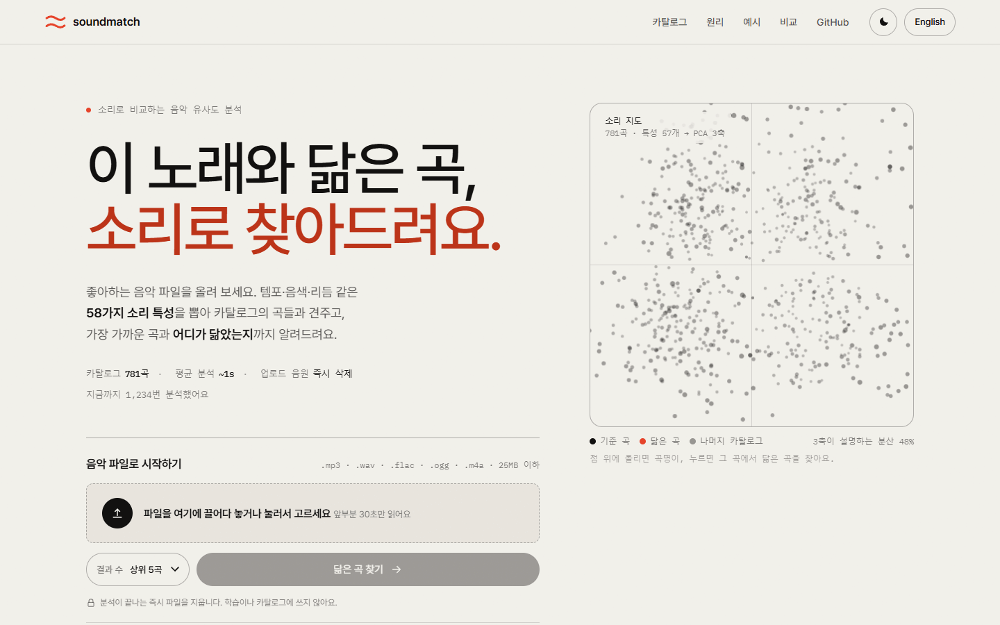
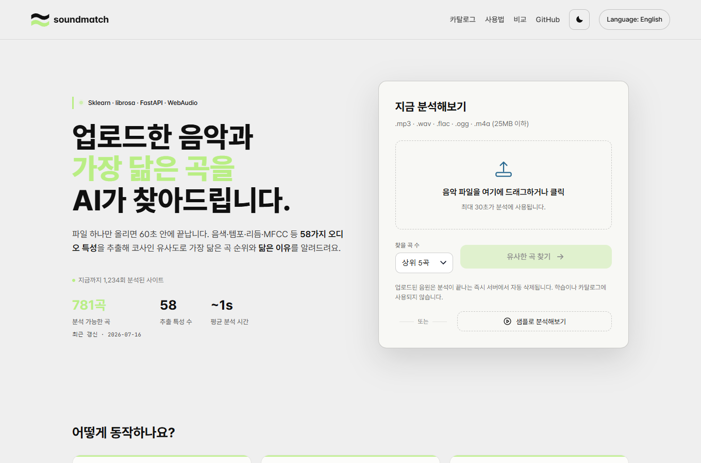
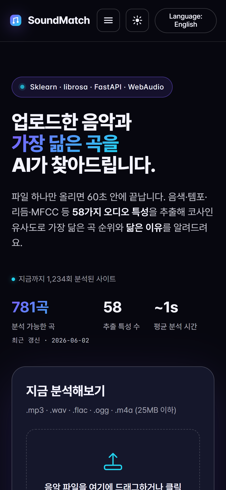

<div align="center">

# 🎵 SoundMatch

**음악을 올리면 가장 닮은 곡을 찾아주고, "왜 닮았는지"까지 설명해주는 오디오 유사도 분석 서비스**


</div>



<br>

## 시작은 졸업작품이었다

팀으로 만들었던 [easygap/capstone_music](https://github.com/easygap/capstone_music) 를 혼자 다시 붙잡았다.
주피터 노트북 한 장에서만 돌던 분석기를, 누구나 브라우저로 열어서 써볼 수 있는 서비스로 만들어보고 싶었다.

지금은 음원 파일 하나만 올리면 끝난다. **librosa** 로 음색·템포·리듬·MFCC 등 **58가지 특성**을 뽑고,
미리 계산해둔 **781곡 카탈로그**와 **코사인 유사도**로 비교해서 — 가장 닮은 곡과 그 이유를 돌려준다.
원작의 분석 알고리즘은 그대로 두고, 그 위에 FastAPI 서버 · SPA 프론트 · Docker · CI 를 새로 얹었다.

> 🔒 업로드한 음원은 분석이 끝나는 즉시 지운다. 어디에도 저장하거나 학습에 쓰지 않는다.

<br>

## 그냥 "닮았어요"로 끝내지 않는다


가장 공들인 부분이다. 순위만 툭 던지는 대신, 업로드한 곡과 1위 매칭의 오디오 지문을 레이더 차트로 겹쳐 보여주고 —
"템포·리듬이 96% 닮았다"는 식으로 **어디가 왜 닮았는지**를 한국어 문장으로 풀어준다.

준비된 음원이 없어도 괜찮다. 메인 화면의 **🎧 샘플로 분석해보기** 한 번이면 결과 화면을 그대로 둘러볼 수 있다.

<br>

## 둘러보고, 비교하고

<table>
<tr>
<td width="50%" valign="top">

**카탈로그** — 검색하고 필터 걸어 곡을 훑어보다가, 마음에 드는 곡을 누르면 그 곡과 닮은 5곡을 바로 띄워준다.


</td>
<td width="50%" valign="top">

**비교** — 최근 분석한 두 곡을 나란히 놓고 메트릭을 맞대본다. 좋아진 값은 초록, 나빠진 값은 빨강.


</td>
</tr>
</table>

다크·라이트 테마, 모바일, 한국어/영어, PWA(홈 화면 추가·오프라인)까지 — 어떤 환경에서 열어도 흐트러지지 않게 다듬었다.

<table>
<tr>
<td width="64%"></td>
<td width="36%"></td>
</tr>
</table>

<br>

## 어떻게 동작하나

<table>
<tr>
<td align="center" width="33%"><h3>1️⃣ 특성 추출</h3></td>
<td align="center" width="33%"><h3>2️⃣ 유사도 계산</h3></td>
<td align="center" width="33%"><h3>3️⃣ 이유 설명</h3></td>
</tr>
<tr>
<td valign="top">

librosa 로 RMS·BPM·스펙트럴
센트로이드·크로마·20-MFCC 등
**58가지 특성**을 뽑는다.

</td>
<td valign="top">

`StandardScaler` 로 정규화한 뒤
`cosine_similarity` 로 전곡과 비교,
**가장 닮은 순**으로 정렬한다.

</td>
<td valign="top">

특성별 거리를 음악적 그룹으로 묶어
**"왜 닮았는지"** 를 사람이 읽는
문장으로 풀어준다.

</td>
</tr>
</table>

<br>

## 빠르게 실행하기

```bash
python -m venv .venv
source .venv/bin/activate          # Windows: .venv\Scripts\activate
pip install -r requirements-dev.txt

uvicorn backend.main:app --reload   # → http://localhost:8000
```

Docker 가 편하면 `docker compose up --build` 한 줄이면 된다.
무거운 오디오 라이브러리 없이 **화면만** 보고 싶다면 `python preview_server.py 8765` — 더미 데이터로 전 페이지가 그대로 뜬다.

<br>

## 조금 더 들어가면

- **CLI** — 서버 없이 파일·폴더 단위 분석, 두 곡 비교, 배포 헬스체크까지 (`python -m backend.cli --help`)
- **API** — 모든 엔드포인트는 `/docs` 의 Swagger 문서에서 바로 눌러볼 수 있다
- **설정** — rate limit · CORS · 캐시 · 프록시 신뢰 범위 등은 `MUSIC_*` 환경 변수로 조정
- **카탈로그 교체** — `scripts/rebuild_dataset.py` 로 내 음원 폴더를 통째로 다시 카탈로그화

**기술 스택** &nbsp;·&nbsp; Python · FastAPI · librosa · scikit-learn · numpy 위에, 프레임워크 없이 짠 Vanilla JS SPA + PWA. 배포는 Docker, 검증은 GitHub Actions(3개 파이썬 버전 매트릭스).

<br>

## 운영 메모

배포된 서버가 기대한 버전인지 확인할 때는 CLI 를 바로 쓴다.

```bash
python -m backend.cli version
# v1.8.19 · 2026-07-15 · <git-sha>

python -m backend.cli status --url https://your-soundmatch.example --ready
```

핵심 설정만 추리면 아래 정도다. 전체 값은 `backend/main.py` 의 `MUSIC_*` 기본값을 따른다.

| 이름 | 기본 | 설명 |
| --- | --- | --- |
| `MUSIC_ENV` | `development` | `production` 이면 HSTS 와 엄격한 CORS 설정을 사용한다. |
| `MUSIC_DATASET_PATH` | `data/dataset.csv` | 비교에 사용할 카탈로그 CSV 경로. |
| `MUSIC_MAX_UPLOAD_BYTES` | `26214400` | 업로드 파일 크기 제한. 기본은 25MB. |
| `MUSIC_RATE_LIMIT_PER_MIN` | `12` | IP 기준 분당 분석 요청 한도. |
| `MUSIC_GIT_COMMIT` | "" | `/api/version` 과 `/api/health` 에 노출할 짧은 배포 SHA. |
| `WEB_CONCURRENCY` | `1` | Docker / Render / Fly 기본값은 단일 worker. rate limit, 캐시, metrics 가 메모리 기반이라 여러 worker 를 쓰려면 Redis 같은 외부 상태 저장소를 먼저 붙여야 한다. |

<br>

## 릴리즈

1. `CHANGELOG.md` 의 `[Unreleased]` 내용을 `## [x.y.z] — YYYY-MM-DD` 섹션으로 옮긴다.
2. `backend/__init__.py` 의 `__version__` 을 같은 `x.y.z` 로 올린다.
3. README 의 `python -m backend.cli version` 출력 예시와 OpenAPI 스키마 예시도 같은 버전으로 맞춘다.
4. main CI 가 초록인지 확인한 뒤 `git tag vx.y.z && git push origin vx.y.z`.

태그가 푸시되면 GitHub Release 워크플로가 CHANGELOG 섹션을 그대로 릴리즈 노트로 사용한다.
태그 버전, `backend.__version__`, `CHANGELOG.md` 의 릴리즈 섹션이 하나라도 다르면 릴리즈 생성을 중단한다.

<br>

## 알아둘 것

- 분석은 곡의 **앞 30초**만 본다. 가장 특징적인 후렴구가 안 잡힐 수 있다.
- 카탈로그는 **781곡** 규모. 더 커지면 코사인 유사도 대신 Annoy·FAISS 같은 ANN 구조가 맞다.
- rate limit·metrics 가 메모리 기반이라, 여러 워커로 띄우면 값이 워커별로 나뉜다.
- 결과는 **취미·학습용**이다. 저작권이나 라이선스 판단의 근거는 될 수 없다.

<br>

## 라이선스

MIT. 원작 캡스톤 데이터셋과 코드는 [easygap/capstone_music](https://github.com/easygap/capstone_music) 에서 볼 수 있다.
