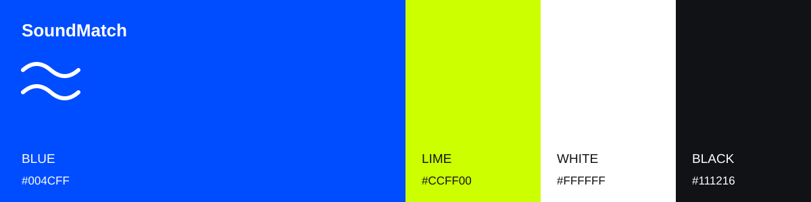

# SoundMatch 화면 설계

조사·반영 기준: **2026년 9월 22일**. 자료 확인 날짜이며, 소개한 스튜디오 작업과 서체가 모두 2026년에 제작됐다는 뜻은 아니다.

음악을 직접 듣고, 두 소리의 차이를 확인한 뒤 자신의 파일로 넘어가게 한다.
화면의 중심은 실제 샘플의 주파수 데이터를 입체로 펼친 그래프다.

## 조사한 자료와 적용한 부분

| 자료 | 확인한 내용 | 적용 |
| --- | --- | --- |
| [Figma — 2026 웹 디자인 트렌드](https://www.figma.com/resource-library/web-design-trends/) | 선명한 색, 큰 글자, 입체 요소와 모션, 가벼운 웹 구현을 함께 다룬다. | 포화도가 높은 첫 화면과 큰 한글 제목. 입체 표현을 샘플 비교에 연결하고 불필요한 반복 렌더링을 없앴다. |
| [Pentagram — Warner Music Group](https://www.pentagram.com/work/warner-music-group) | 진한 파랑, 음악의 에너지를 담은 색, 표현력 있는 타이포그래피를 사용한다. | 첫 화면 전체에 파랑을 쓰고 작은 라임 포인트와 조합했다. 로고·고유 각도·서체를 복제하지 않았다. |
| [Studio Dumbar — North Sea Jazz](https://studiodumbar.com/work/north-sea-jazz) | 음악의 리듬을 색·형태·움직임으로 확장했다. | 재생 위치가 실제 주파수 선 위에 표시되도록 했다. |
| [Figma — Chartreuse 색상표](https://www.figma.com/colors/chartreuse/) | `#CCFF00`의 분할 보색 조합에 `#004CFF`가 포함된다. | 두 색을 선택하고 검정·흰색으로 읽기 영역을 구분했다. 팔레트 전체를 그대로 채택하지 않았다. |
| [LINE Seed KR 공식 소개](https://seed.line.me/index_kr.html) | LINE·산돌 협업, 네모꼴 한글, 한글과 라틴의 무게중심 조화, 굵기에 따른 간격 설계. | Bold를 첫 화면 제목과 큰 유사도 숫자에 사용했다. 실제 브라우저에서 기존 제목과 비교한 뒤 적용했다. |
| [원티드 브랜드센터](https://www.wanted.co.kr/brandcenter/) / [Wanted Sans](https://github.com/wanteddev/wanted-sans) | 국내 제품의 색상 역할과 한글·라틴 가변 서체 운용. | 서체 후보와 브랜드 운용 사례로 검토했다. 최종 화면의 서체·색상은 별도로 선택했다. |
| [Pretendard 공식 저장소](https://github.com/orioncactus/pretendard) | 한글·라틴 UI를 함께 다루는 가변 서체와 서브셋 배포. | 본문·폼·표에 사용하고 필요한 문자만 로컬 배포한다. |

자료는 선택의 근거다. 특정 색이나 효과를 사용했다는 이유만으로 독창성이나 완성도를 단정하지 않는다.

## 색상표

| 색 | 값 | 역할 |
| --- | --- | --- |
| 블루 | `#004CFF` | 첫 화면 전체, 라이트 모드의 주요 버튼·링크·A 그래프 |
| 라임 | `#CCFF00` | 파란 화면의 A 파형, 유사도, 업로드 버튼 |
| 흰색 | `#FFFFFF` | 파란 화면의 글자·B 파형, 분석 화면의 바탕 |
| 검정 | `#111216` | 분석 화면의 본문·B 그래프, 다크 모드의 바탕 |

라임은 흰 바탕 위 작은 글자로 쓰지 않는다. 밝은 분석 화면은 파랑 A / 검정 B,
첫 화면은 라임 A / 흰색 B로 구분하고 A/B 문자도 함께 쓴다. 오류·주의·완료는 별도 상태색을 사용한다.

## 타이포그래피

| 용도 | 서체 | 설정 |
| --- | --- | --- |
| 첫 화면 제목 | LINE Seed KR Bold 파생 서브셋 | 데스크톱 최대 74px, 700, 행간 1.14, 자간 -0.025em |
| 큰 유사도 숫자 | 같은 제목용 서체 | 데스크톱 66px, 700, 고정폭 숫자 기능 |
| 본문·입력·표 | Pretendard Variable 파생 서브셋 | 15–16px 중심, 본문 400, 주요 항목 600 |
| 모바일 제목 | 같은 제목용 서체 | 35–43px 중심, 한글 어절 유지 |

제목 서체는 첫 화면 한글과 ASCII만 묶어 약 9KB로 제공한다. 본문용 글꼴도 UI 문자를 추려 로컬에 둔다.
글꼴 수정본은 원본과 구분하도록 SoundMatch Display / SoundMatch UI로 이름을 바꾸고 원 저작권과 OFL을 보존한다.
임의의 업로드 파일명 등 서브셋에 없는 문자는 시스템 글꼴로 표시한다.

## 화면과 움직임

1. 9초짜리 자체 제작 샘플을 A/B로 바꿔 듣는다. 위치를 유지하며 음색·리듬을 비교한다.
2. 시간별 주파수 지형, 평균 주파수 분포, 특성별 막대를 확인한다.
3. 자신의 파일 또는 샘플을 실제 엔진으로 분석하고 추천 곡에서 탐색을 이어 간다.

입체 그래프의 가로는 mel 주파수 대역, 깊이는 시간, 높이는 공통 범위로 정규화한 상대 에너지다.
그림의 모양이 유사도 수치 자체를 나타내지는 않는다. 유사도는 57개 특성에서 별도로 계산한다.
좁은 화면에서는 제목과 그래프를 세로로 배치하고 범례·그래프·조작 버튼 영역을 나눈다.
곡 사이에 불투명한 면을 채우지 않아 선이 서로 가리지 않게 했다. 화면이 좁을수록 표시하는 시간 단면의 간격을 넓히고,
시점이 바뀔 때 실제 투영 범위에 맞춰 그래프 크기를 조정한다. 분석값과 재생 커서에는 전체 데이터를 사용한다.

## 성능

- Canvas 2D에 실제 데이터를 투영한다. 정적인 지형과 재생 위치를 다른 캔버스에 그린다.
- 시점·겹침 전환만 유한한 애니메이션으로 처리한다. 화면 밖·백그라운드에서는 갱신을 멈춘다.
- 모션 감소 설정에서는 시점 전환을 즉시 반영한다.
- 음원은 처음 재생·분석·다운로드할 때 요청한다.
- 스크립트 `defer`, 텍스트 압축, 로컬 글꼴, 필요한 예시 데이터만 전송하는 방식으로 로딩을 줄인다.
- 기존 FastAPI·librosa·scikit-learn·순수 HTML/CSS/JavaScript 구성을 유지한다.

구현 근거: [MDN Canvas 최적화](https://developer.mozilla.org/en-US/docs/Web/API/Canvas_API/Tutorial/Optimizing_canvas),
[web.dev 렌더링 성능](https://web.dev/articles/rendering-performance), [Web Vitals](https://web.dev/articles/vitals).
측정 결과는 [검증 기록](verification-2026.md)에 정리한다.
