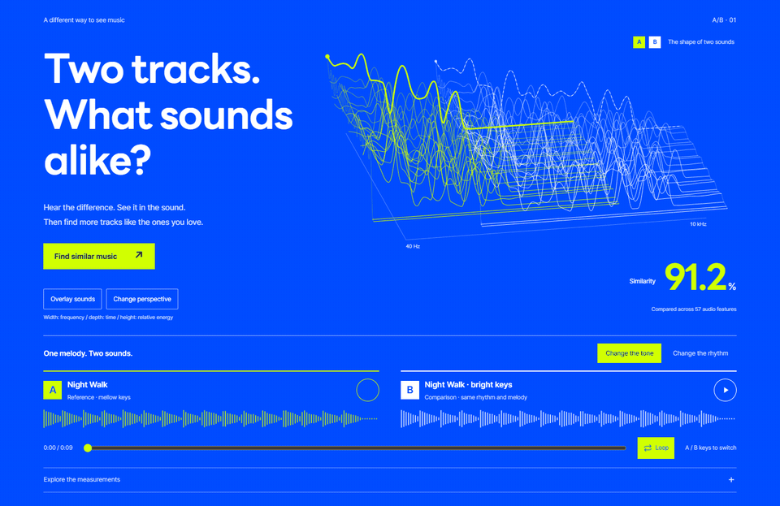
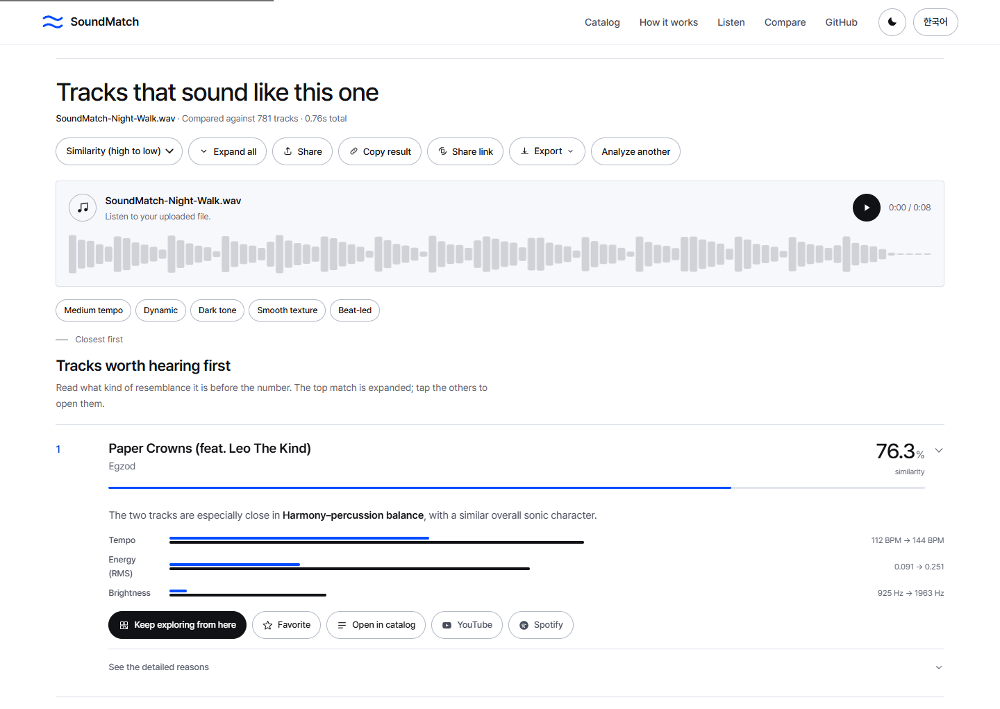
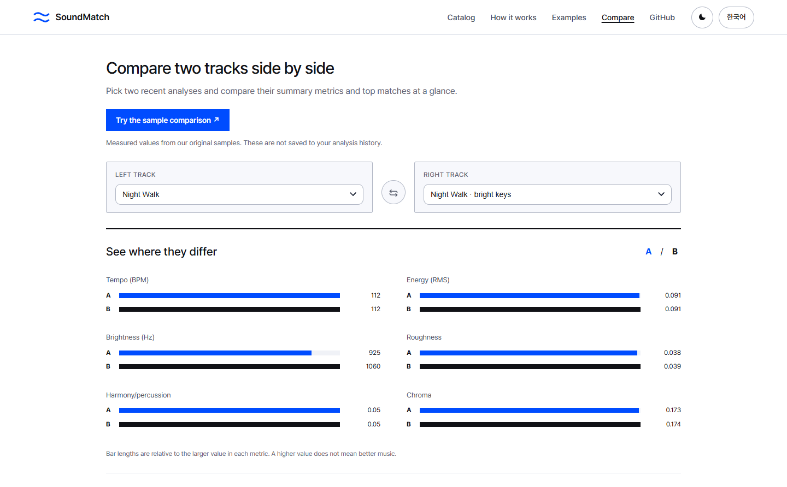
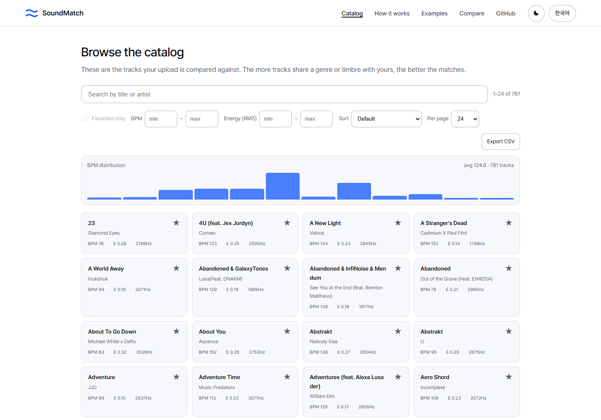

# SoundMatch

[한국어](../../README.md) · [English](README.en.md) · **日本語** · [简体中文](README.zh-CN.md)

**手元の音楽ファイルから、似た曲を探すWebアプリです。**

MP3やWAVを読み込むと、収録された**781曲**から音の特徴が似た曲を探せます。
テンポや音色をグラフで比べたり、気に入った候補からさらに似た曲を探したりできます。
自分のパソコンで動作し、アカウント登録やAPIキーは不要です。

[起動方法](#start) · [曲を探す](#find-tracks) · [不具合の報告](https://github.com/easygap/music_similarity/issues/new/choose)

<picture>
  <source media="(prefers-reduced-motion: reduce)" srcset="../screenshots/hero-en.png">
  
</picture>

アプリの画面は韓国語と英語に対応しています。以下のボタン名と画面例は英語表示に合わせています。韓国語で表示された場合は、右上の **English** で切り替えられます。

## まずはサンプルを聴き比べる

トップページには、同じメロディーで音色やリズムを変えた**約9秒のサンプル**があります。
**AとBの再生ボタンを押すと、再生位置を保ったまま切り替えられます。**
サンプルの操作欄にフォーカスがあるときは、キーボードのA・Bキーでも切り替えられます。**Loop** をオンにすると繰り返し再生します。

グラフの太い実線は再生中の曲、破線はもう一方の曲の同じ再生位置を示しています。
**Overlay sounds** を押すと、2つのグラフを重ねて比較できます。

GIFに音声はありません。音を聴くにはアプリを起動するか、サンプルをダウンロードしてください。
[元の音源](../../frontend/assets/demo/original.wav?raw=true) · [明るい音色](../../frontend/assets/demo/tone.wav?raw=true) · [速いリズム](../../frontend/assets/demo/rhythm.wav?raw=true)

<a name="find-tracks"></a>

## 自分の音楽ファイルで探す

1. 音楽ファイルをドラッグ＆ドロップするか、アップロード欄をクリックして選びます。
2. **Find similar tracks** を押すと、似ている曲から順に表示されます。
3. 気になる曲があれば、**Keep exploring from here** でその曲に似た曲を探せます。



各曲にはYouTubeとSpotifyの検索リンクがあります。聴いてみたい曲は、リンク先で探せます。

| 対応ファイル | ファイルサイズの上限 | 分析する範囲 |
| --- | --- | --- |
| MP3 · WAV · FLAC · OGG · M4A | 25MB | 曲の先頭から最大30秒 |

## 2曲を並べて比べる

分析履歴から2曲を選ぶと、テンポ、音量、音色を並べて確認できます。
履歴がまだない場合は、**Try the sample comparison** でサンプルの比較結果を表示できます。



気に入った曲はお気に入りに保存できます。
結果はリンクで共有するほか、画像（PNG・SVG）、表データ（CSV）、JSONとしてダウンロードできます。

## 収録曲を探す

**Catalog** では曲名やアーティスト名で検索できます。テンポや音量で絞り込むこともできます。



<details>
<summary>スマートフォンでの表示とダークモード</summary>

<table>
<tr>
<td width="70%" valign="top"></td>
<td width="30%" valign="top"></td>
</tr>
</table>

</details>

<a name="start"></a>

## 自分のパソコンで使う

[Git](https://git-scm.com/downloads)と[Docker](https://docs.docker.com/get-started/get-docker/)をインストールしてから、以下を実行してください。

```bash
git clone https://github.com/easygap/music_similarity.git
cd music_similarity
docker compose up --build
```

サーバーが起動したら、ブラウザーで **[localhost:8000](http://localhost:8000)** を開きます。
初回は必要なソフトウェアをダウンロードするため、少し時間がかかります。

音楽ファイルを用意しなくても、トップページの **Analyze the sample you just heard** からサンプルを分析できます。

<details>
<summary>Dockerを使わずに起動する</summary>

Python 3.11・3.12・3.14で動作を確認しています。[FFmpeg](https://ffmpeg.org/download.html)もインストールしてください。
上の `git clone` と `cd` を実行したあと、使用するOSに合わせて以下を実行します。

**Windows PowerShell**

```powershell
python -m venv .venv
.venv\Scripts\python.exe -m pip install -r requirements.txt
.venv\Scripts\python.exe -m uvicorn backend.main:app
```

**macOS · Linux**

```bash
python3 -m venv .venv
.venv/bin/python -m pip install -r requirements.txt
.venv/bin/python -m uvicorn backend.main:app
```

ブラウザーで [localhost:8000](http://localhost:8000) を開きます。

</details>

## よくある質問

**どんな曲が検索対象ですか？**

このプロジェクトに収録された781曲が対象です。インターネット上のすべての曲を検索するものではありません。曲の一覧は **Catalog** で確認できます。

**アップロードしたファイルは保存されますか？**

分析のためにサーバー上へ一時保存し、分析が終わると削除します。上の手順でアプリを起動した場合、ファイルは自分のパソコン内で処理されます。AIの学習には使用しません。分析履歴とお気に入りはブラウザーに保存されます。

**類似度の数値は何を表していますか？**

テンポや音色など、音の特徴がどれだけ似ているかを示しています。メロディーの一致率や、盗作かどうかを判断する数値ではありません。分析するのは先頭の最大30秒なので、それより後のサビなどは結果に反映されません。

**不具合はどこへ報告できますか？**

[Issue](https://github.com/easygap/music_similarity/issues/new/choose)に、使用したブラウザーと問題が起きるまでの操作を記載してください。スクリーンショットもあると、状況を確認しやすくなります。

---

卒業制作の [capstone_music](https://github.com/easygap/capstone_music)をもとに開発しています。
[開発への参加](../../CONTRIBUTING.md) · [更新履歴](../../CHANGELOG.md) · [テスト・性能の確認結果](../verification-2026.md)（リンク先は韓国語）

コードと自作のサンプル音源は[MITライセンス](../../LICENSE)、フォントはSIL OFLで配布しています。
[Pretendard](../../frontend/assets/fonts/OFL.txt) · [LINE Seed KR](../../frontend/assets/fonts/LINE-Seed-OFL.txt)
